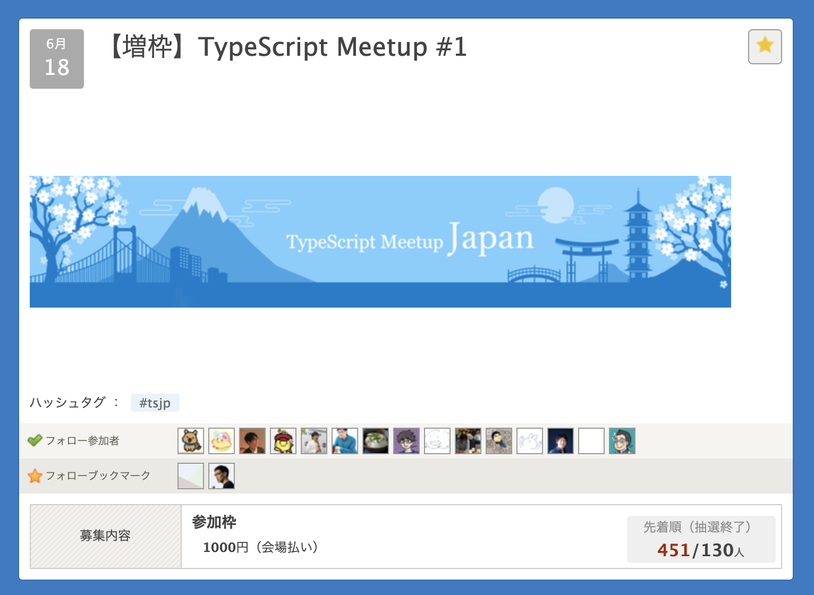
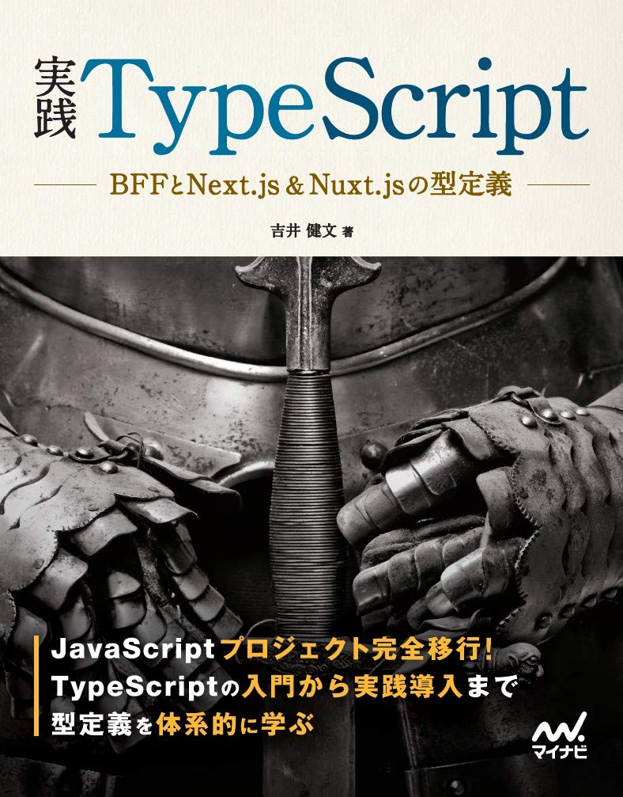

# TypeScript書いたことある人🙋

---

# HRBrainではTypeScriptを採用しています！🎉
TypeScriptは人権

---

# TypeScript Meetup #1

めっちゃ盛り上がってる

---

# 実践TypeScript

6/26
 
   
 
バチボコいい本（この絵何？）

---

# やるなら今しかない 😋

---

# Q. とはいえ型付けられるだけでしょ

## A. これを見て
<iframe src="https://www.typescriptlang.org/play/#code/C4TwDgpgBAEg9gVwE4DUCGAbB0C8UCMUAPlAEzFQDMFALBQKwUBsFA7BQBwUCcF+ADH0Il8pAFBiAlgDtgEJADM0AY2gBJeMgA8AFSgQAHnOkATAM6xEqTNgB8UAN5ioLqAHMIwdFggAKAJQAXFA6YgC+EsoYaGYWmki6+kYQpnFW3nZQkgC2YBgQ2SnAFhpWuvZOrlDKcNJmwEgIysBwSL5gSJIAbmhyUD0+wTr+jhHOrh5eNn4jlVWuSJ7I0lDAABaSZgB0A9jjLhFjAPRHUIDKDIAxDID2DADyANIAhGI1dcBQtbhQ0hAA7pbIvnw-metXqqx+cCgeG+f3ivlIwLEJyggAGGQCHDCDXlAAF7ySHQ37-Nr8YFAA" height="500px"></iframe>

---

# ビビるくらい柔軟な型付け
型パズルとか言います

---

# みんなで型パズルの片鱗を味わおう 💪
